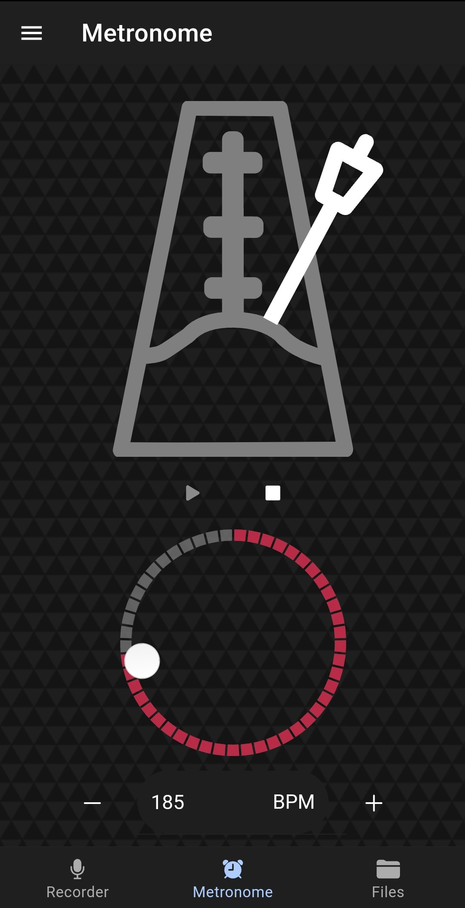
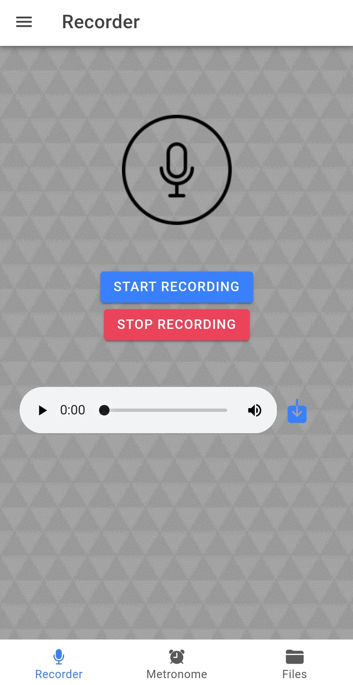
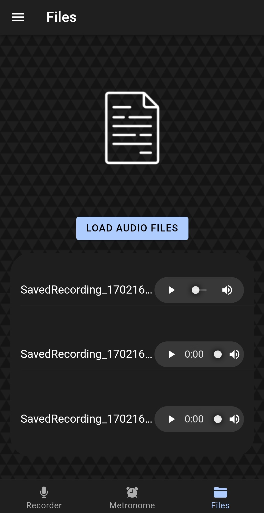
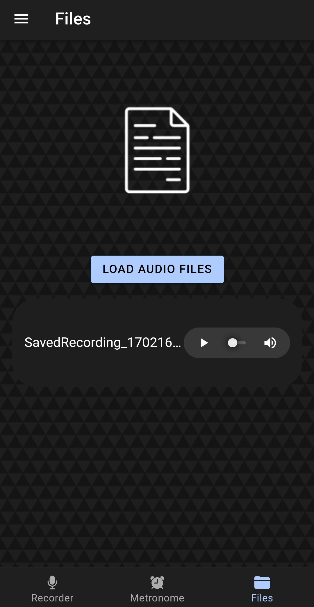
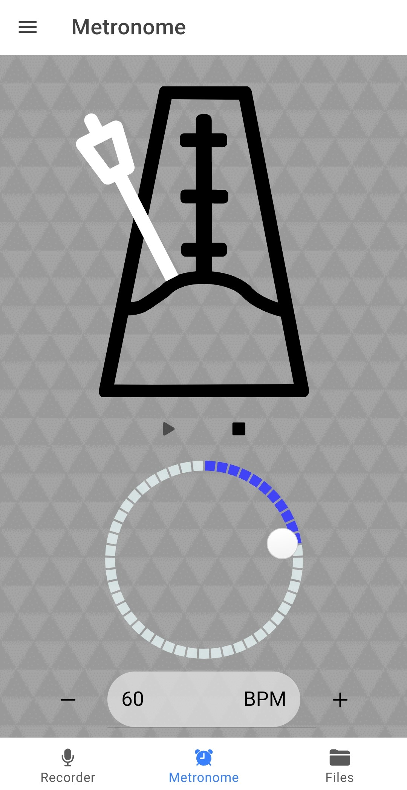
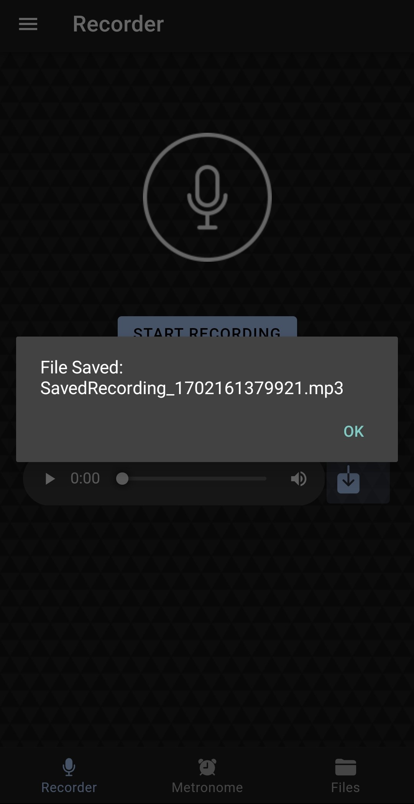
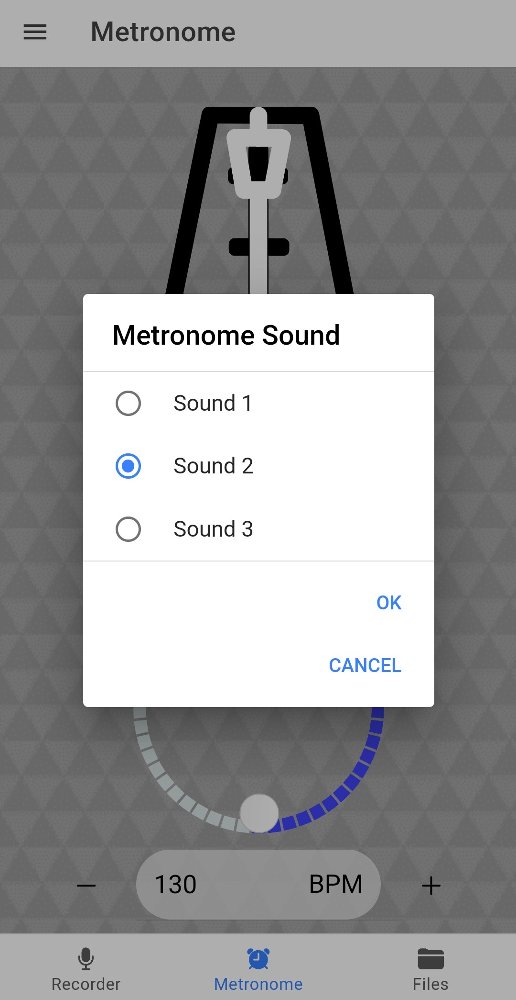

# Metronome & Recorder App

A cross-platform mobile app using React and Ionic was made for musicians to help record their music and even help with their timing. 

Features:
- Cross-platform support for Android and Web
- Metronome with customizable BPM and sound
- Recorder that can record audio and save the file to the device
- Files tab to play previously recorded files
- Support for both dark and light modes

Screenshots: 

How to Run the App:
- Go to the command line and change directory into the root
- Install node modules if you don't already have it
- Run 'ionic Build' and install Vite when it prompts you
- Run 'ionic cap sync'
- Then you're ready for either:

Web Version:
- Run 'ionic serve'

Android Version:
- Install Android Studio
- Run 'npx cap open android' in the root
- This will open the android studio project, either plug in your physical phone or set up a virtual one
- Press the green run button once its ready, and it will install!
